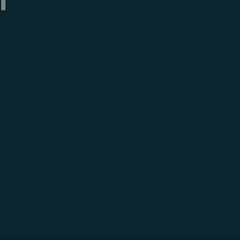

# A Russian DialoGPT model

This is a fork of the [DialoGPT](https://github.com/microsoft/DialoGPT) repository. With code and pretrained dialogue response generation model for russian language. 

## Used repositories

* The toketisator is from the [YouTokenToMe](https://github.com/VKCOM/YouTokenToMe) repository.
* The model architecture is trom [HuggingFace](https://github.com/huggingface/transformers).
* The fp16 realisation is from the [Megatron-LM](https://github.com/NVIDIA/Megatron-LM) repository.
* Pretrained GPT-2 model is from the [ruGPT2](https://github.com/vlarine/ruGPT2) repository.

## Training the model

Input dataset must be in the DialoGPT tsv format:

```
0.0 Вот, держите. EOS А на чай? EOS Никакого чая. я ученый, а не банкир.	1.0 Ага, не банкир. живет во дворце и денег нет, так я и поверил.
0.0 Я собиралась спросить тебя то же самое.	1.0 Я получил записку от сэра Гарри, в которой он просит меня подойти к окну.
0.0 Не смущайся! Об него всегда все ударяются. Вечно он стоит где не надо!	1.0 Зачем - Джаф - тебе - помог?
0.0 Вот, один врачу, другой вам.	1.0 А нам-то за что?
```

Prepare the train data:

```
./scripts/preprocess.sh
```

Download a GPT-2 model from [ruGPT2](https://github.com/vlarine/ruGPT2). And convert it with the `convert_megatron_to_dialogpt.py` script:

```
./scripts/convert.sh
```

Train the model:

```
./scripts/train.sh
```

## Download pretrained model

There is a model trained for 6 days on 2x1080Ti GPU. Model trained on the russian books dialogues for 300K steps with batch size 64.

[300K books dialogues model](https://drive.google.com/open?id=1I9ZenlFfkrFcauJAOdcIFxFzpT5k6Kpp)

## Run dialogue interaction

There is the script to start the interaction:

```
./script/interact.sh
```




## Run a telegram bot

A telegram bot is based on code from [gpt2bot](https://github.com/polakowo/gpt2bot) repository.

Add your telegram bot token to the [script](./script/run_bot.sh) and run:

```
./script/run_bot.sh
```


